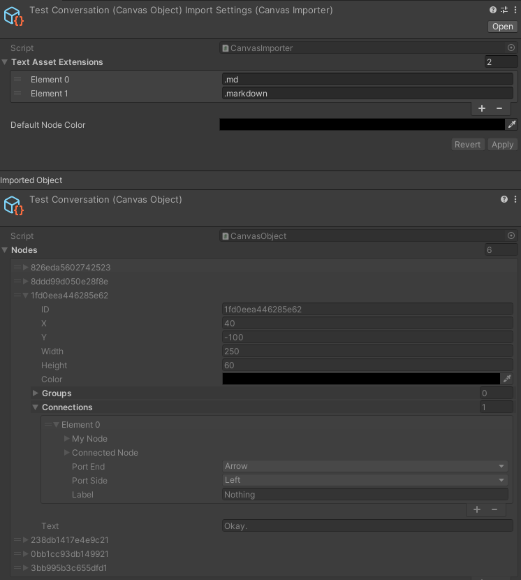
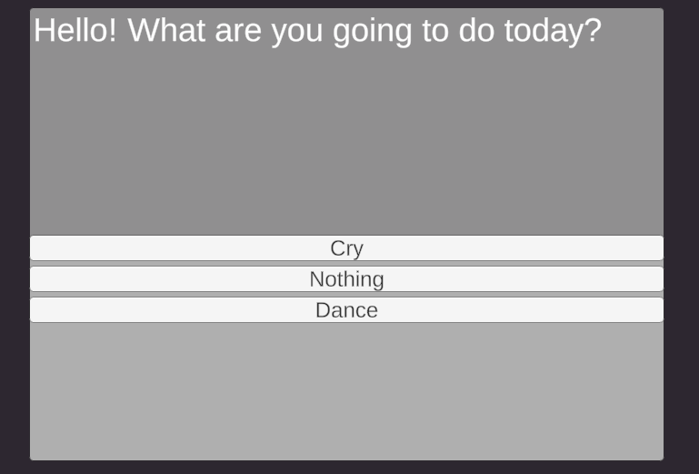
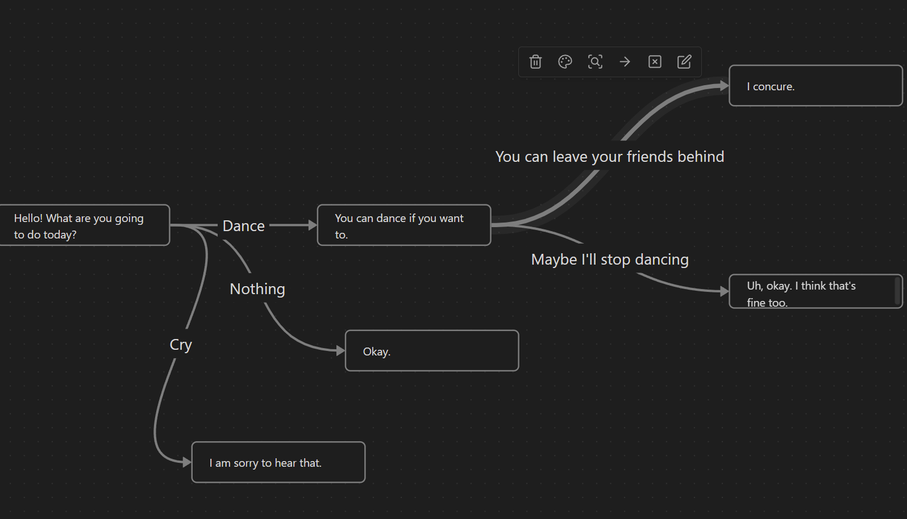

# Obsidian Canvas Importer for Unity

Make an [Obsidian]() vault directly inside of your Unity project, and the ".canvas" [Obsidian Canvas](https://obsidian.md/canvas) files will be imported as readable game data (basically, scriptableObjects with a list of nodes).

## How  To Use

This project is a proof-of-concept, and not a production-ready asset. Explore it if you're thinking about doing something similar. If you want to use it for your own project, adding the "Obsidian Canvas/Scripts" folder to your project should get your started. .canvas files are imported as "CanvasObject" files, scriptableObjects.

## How It Works

Obsidian Canvas files are just JSON, so we simply parse that into an intermediary data type. Once we have the data as C# classes (in the "JSON Types" folder), we loop through them and turn them into "prettier" classes (in the "Data" folder). Notably, instead of storing a "Nodes" and "Edges" array, I only store a Nodes array, and each node contains "Connections", and I can use polymorphism for node types.

> This is for three reasons. First, I think the 'edges' array needs a fast lookup by ID, probably with a Dictionary. I don't want to deal with serializing and deserializing dictionary data, which Unity does not natively support. 
>
> Second, I don't have a single source of truth for nodes. (ie: node a points to b, b points to a, but they could get "out of sync" and cause bugs if not properly updating the different locations that the single conceptual 'edge' is saved.) This is not a problem because the data comes from the file - the single source of truth - and I don't plan on adding support for updating during runtime. If I did, I would have to rethink this. 
>
> Second, I prefer to work with graphs from the "inside", following nodes through their connections, for the kinds of things I use nodes for. 

There is a root "AssetNode<T>" that encapsulates the "file" reference logic. Currently I've tested it referencing TextAssets (markdown files) and other Canvases, and images appear to work too.

## Why?

I don't know. There isn't (yet!) a way to add more JSON fields within Canvas, which means making the information useful for game development isn't quite there yet. That being said, I could write a plugin for obsidian that does serialize some kind of data into the JSON .canvas file and... and then were getting somewhere useful!

> To be fair, if we are at the point we are writing custom Obsidian extensions... we should probably just extend the node systems that are built into Unity. So why did I make this again? 

I wouldn't use this for a dialogue system - labeling the edges in canvas is awkward UI. But I would use this for a higher-level node network or quest system, and then use https://www.inklestudios.com/ink/. Each conversation is a file, and could be saved inside the obsidian vault right inside the assets directory.

So, basically, I don't know why I made this. But I think it's a neat idea to be able to use an obsidian vault for game data. So here we are.

---

## Things  To Be Aware Of

- The Rects in Node are in "Obsidian Space". That is, they do not mean anything in Unity units, its the data from the obsidian canvas.
- GroupNodes can have GroupNodes as children.
- Many things are currently public that should (er... "will eventually") be made public-getter private setter. Be safe out there.
- Let me be explicit: Don't update things at runtime.
- It's not fast, and probably very slow for large canvases with lots of nodes. I have not stress-tested it.
- GetNode(string id) on the canvas object is a pretty slow LINQ operation, which is why I try to set it all up on import to avoid having to use it at runtime.
- Color in Node is nullable. This isn't how Color usually works, so you can use the function "GetColor()" to get a non-nullable color (and pass in a default).
- I haven't really tested colors.

---

## Dialogue Example

